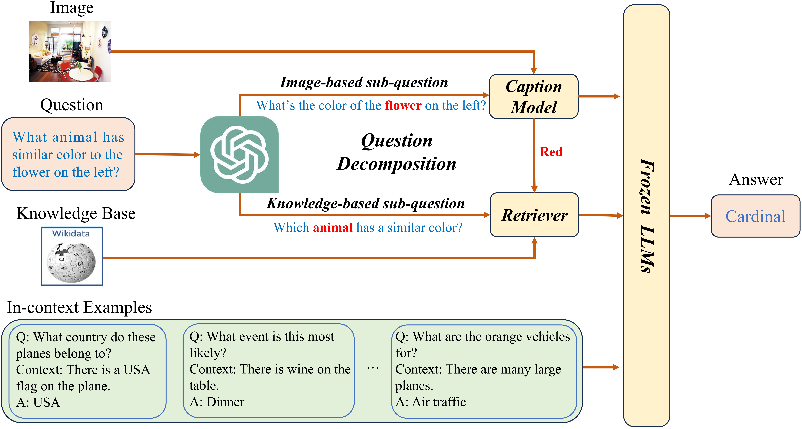

# DKA: Disentangled Knowledge Acquisition
Repo for the paper "Knowledge Acquisition Disentanglement for Knowledge-based Visual Question Answering with Large Language Models"

[](https://arxiv.org/abs/2407.15346)



## Abstract
Knowledge-based Visual Question Answering (KVQA) requires both image and world knowledge to answer questions. 
Current methods first retrieve knowledge from the image and external knowledge base with the original complex question, then generate answers with Large Language Models (LLMs). However, since the original question contains complex elements that require knowledge from different sources, acquiring different kinds of knowledge in a coupled manner may confuse models and hinder them from retrieving precise knowledge. Furthermore, the ``forward-only'' answering process fails to explicitly capture the knowledge needs of LLMs, which can further hurt answering quality.
To cope with the above limitations, we propose DKA: Disentangled Knowledge Acquisition from LLM feedback, a training-free framework that disentangles knowledge acquisition to avoid confusion and uses LLM's feedback to specify the required knowledge.
Specifically, DKA requires LLMs to specify what knowledge they need to answer the question and decompose the original complex question into two simple sub-questions: Image-based sub-question and Knowledge-based sub-question. Then we use the two sub-questions to retrieve knowledge from the image and knowledge base, respectively. In this way, two knowledge acquisition models can focus on the content that corresponds to them and avoid disturbance of irrelevant elements in the original complex question, which can help to provide more precise knowledge and better align the knowledge needs of LLMs to yield correct answers. Experiments on benchmark datasets show that DKA outperforms SOTA models.

## Install
First, please install the necessary dependencies:
```bash
pip install -r requirements.txt
```
## Usage
You need to download the images, LLaMA model and BLIP model, and then specify the folder name in the run_main.sh!


## Citation

If you find our work useful, please consider citing our paper:

```bibtex
@misc{an2024knowledgeacquisitiondisentanglementknowledgebased,
      title={Knowledge Acquisition Disentanglement for Knowledge-based Visual Question Answering with Large Language Models}, 
      author={Wenbin An and Feng Tian and Jiahao Nie and Wenkai Shi and Haonan Lin and Yan Chen and QianYing Wang and Yaqiang Wu and Guang Dai and Ping Chen},
      year={2024},
      eprint={2407.15346},
      archivePrefix={arXiv},
      primaryClass={cs.CV},
      url={https://arxiv.org/abs/2407.15346}, 
}
```

## Thanks
The code of this repository is mainly based on [Simple](https://github.com/alexandrosXe/A-Simple-Baseline-For-Knowledge-Based-VQA), and we simply add the decomposed caption and knowledge. Thanks for the authors releasing their code.
